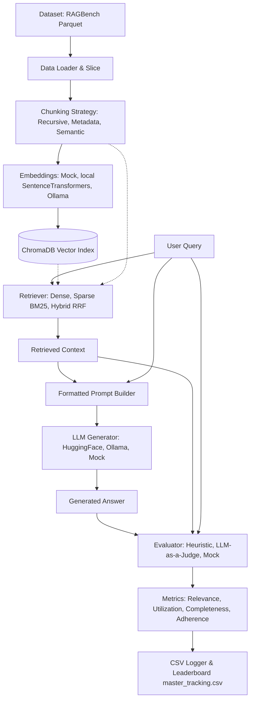

# 🚀 RAGStack Benchmarking & Evaluation Pipeline (ReliableRAG)

Welcome to the **RAGStack Benchmarking Pipeline** (also known as `reliablerag`). This framework is designed to automate, run, and evaluate retrieval-augmented generation (RAG) pipeline configurations across standardized RAGBench datasets (e.g., `covidqa`). It enables a systematic search across different text-splitting, embedding, retrieval, generation, and LLM-as-a-judge evaluation methods to find the optimal setup for a given domain.

---

## 📐 Pipeline Architecture

The workflow is highly modular, separating text processing, embedding, index construction, context retrieval, prompt packaging, response generation, and scoring.



---

## 🛠 Core Modular Components

### 1. Configuration & Profiles ([config.py](./config.py))
Defines the main `ExperimentConfig` dataclass and environment presets:
*   **`local-mock`**: Zero dependencies. Runs with random embedding/generation vectors and constant scores to verify pipeline integration.
*   **`local-real`**: Runs locally using CPU-friendly models (`all-MiniLM-L6-v2` for embeddings) and a local Ollama REST server for generation.
*   **`colab-gpu`**: Designed for high-performance cloud environments (such as Google Colab with T4 GPU runtime). Uses GPU-accelerated embedding models and Hugging Face transformer pipelines.

### 2. Chunking & Splitting ([src/chunking.py](./src/chunking.py))
Provides three text division algorithms:
*   **Recursive Character**: LangChain's `RecursiveCharacterTextSplitter` splitting by character sizes and overlaps.
*   **Metadata-Aware**: Divides text using recursive character partitioning, then prepends domain metadata context tags (e.g., `[Domain: COVIDQA] [Source: q_0_doc_0]`) to each chunk. This injects structured context directly into downstream retrieval models.
*   **Semantic**: Splits the text into individual sentences, generates embeddings for each, computes similarity between adjacent sentences, and creates chunk boundaries at similarity percentiles (splits when similarity falls below the bottom 40%). Falls back to length-based grouping on mock or error states.

### 3. Vector Embeddings ([src/embeddings.py](./src/embeddings.py))
Wraps embedding models into a unified interface:
*   **`MockEmbedder`**: Returns stable, deterministic pseudo-random vectors based on the text hash value (for mock profiles).
*   **`SentenceTransformerEmbedder`**: Loads Hugging Face models locally (e.g., `BAAI/bge-large-en-v1.5` or `all-MiniLM-L6-v2`) with CUDA support.
*   **`OllamaEmbedder`**: Communicates with a local Ollama instance (default port `11434`) via REST APIs.

### 4. Context Retrieval ([src/retrieval.py](./src/retrieval.py))
Supports diverse retrieval paradigms to match query intent:
*   **Dense Retriever**: Interfaces with ChromaDB (ephemeral or disk-persisted vector store) to perform vector distance similarity searches.
*   **Sparse Retriever**: Employs **BM25Okapi** lexical index mapping matching tokens between the query and corpus.
*   **Hybrid Retriever**: Merges dense and sparse retriever outcomes using **Reciprocal Rank Fusion (RRF)**. It sorts and scores matching elements according to:
    $$\text{Score}_{RRF}(d) = \sum_{m \in M} \frac{1}{k + r_m(d)}$$
    (with fallback defaults where $k = 60$).

### 5. Generation ([src/generation.py](./src/generation.py))
Interfaces with text-generation pipelines:
*   **`MockGenerator`**: Returns static placeholders for rapid developer loops.
*   **`OllamaGenerator`**: Connects to a local Ollama instance running text models (e.g. `gemma3:4b-it-q4_K_M`).
*   **`HuggingFaceGenerator`**: Executes native local transformer sequences for text-to-text generative models (e.g. `google/flan-t5-base`).

### 6. Pipeline Evaluation ([src/evaluation.py](./src/evaluation.py))
Measures generated results along four crucial evaluation metrics:
1.  **Context Relevance**: Determines whether the retrieved context is relevant to the question.
2.  **Context Utilization**: Assesses the fraction of generated answer information derived from the provided context.
3.  **Completeness**: Scores how fully the answer addresses the question (length-based heuristic and query keyword overlap).
4.  **Adherence**: Evaluates if the answer stays within facts defined by the context (checks word-overlap and penalizes hallucinations).

Evaluation options include simple **Heuristics** (token overlaps) or **LLM-as-a-Judge** scoring (a prompt-directed LLM evaluates each criteria from 1 to 5, normalized to a 0.2 - 1.0 scale).

### 7. Logging & Aggregations ([src/tracking.py](./src/tracking.py))
*   Logs query-by-query parameters, latency, and individual metrics in detail as a CSV run log inside `eval/results/runs/`.
*   Records aggregate session statistics (e.g., mean adherence, mean latency) as a new entry inside the master leaderboard file `master_tracking.csv`.

---

## 🚀 Running Experiments

Before running experiments, set up your python virtual environment and install the package dependencies:
```bash
python3 -m venv .venv
source .venv/bin/activate
pip install -r requirements.txt
```

### Run a Single Pipeline Instance
Run a pipeline run with customized model overrides:
```bash
python main.py --profile local-mock --dataset covidqa -n 5
```

### Run a Grid Search Configuration Sweep
Use the `--sweep` flag to iterate over cross-combinations of chunking strategies (`recursive`, `semantic`) and retrieval types (`dense`, `hybrid`):
```bash
python main.py --profile local-real --dataset covidqa --sweep
```

### Running on Google Colab (GPU)
For heavy models (e.g. `bge-large` embedders and `flan-t5` generators):
1. Use the pre-built notebook: [run_pipeline_colab.ipynb](./notebooks/run_pipeline_colab.ipynb).
2. Set runtime type to **T4 GPU** on Colab.
3. Execute the benchmarking sweep.
4. Export the resulting zip package (`eval_results.zip`).
5. Run the local merge script to copy remote runs directly into your git workspace tracking:
   ```bash
   python scripts/merge_results.py --zip /path/to/eval_results.zip
   ```

---

## 📊 Summary of Leaderboard Logs

All completed runs update `master_tracking.csv`. You can regenerate markdown leaderboard summaries at any time by running:
```bash
python scripts/merge_results.py --refresh
```
This updates the markdown report [evaluation_summary.md](./eval/evaluation_summary.md) inside the `eval/` folder, grouping and ordering sessions by timestamp, user, and dataset.