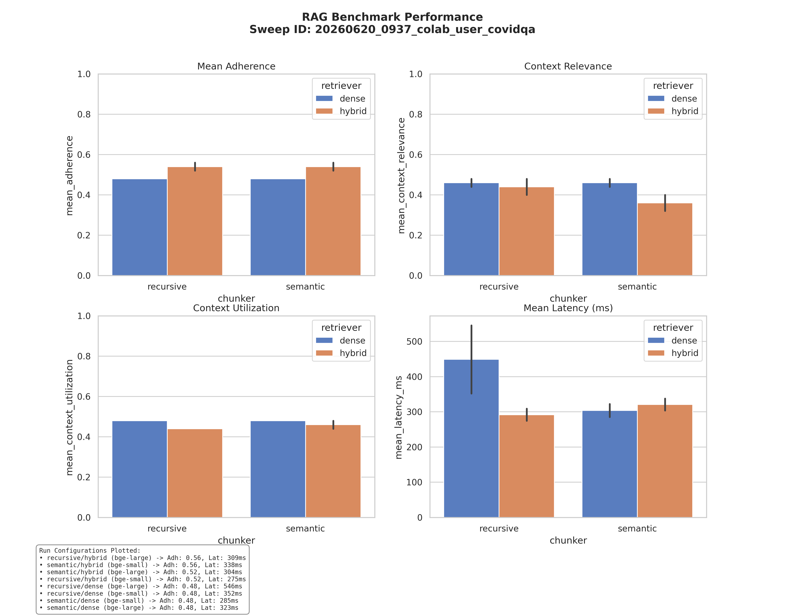

# 🏆 RAGStack Evaluation Leaderboard - 20260620_0937_colab_user_covidqa

This is an automatically generated summary of the RAG benchmarking runs for sweep session `20260620_0937_colab_user_covidqa`.

## 📊 Run Group: covidqa - 2026-06-20 09:37 (User: colab_user)
**Sweep ID:** `20260620_0937_colab_user_covidqa`

| run_id | chunker | embedder | retriever | mean_adherence | mean_context_relevance | mean_context_utilization | mean_latency_ms | timestamp |
| --- | --- | --- | --- | --- | --- | --- | --- | --- |
| 20260620_0937_colab_user_covidqa_recursive_bge-small_dense | recursive | bge-small | dense | 0.480 | 0.480 | 0.480 | 352.4 | 2026-06-20T09:37:28.098054 |
| 20260620_0937_colab_user_covidqa_recursive_bge-large_dense | recursive | bge-large | dense | 0.480 | 0.440 | 0.480 | 545.5 | 2026-06-20T09:37:51.316449 |

### Performance Visualization

*Last updated: 2026-07-05 12:20:59*