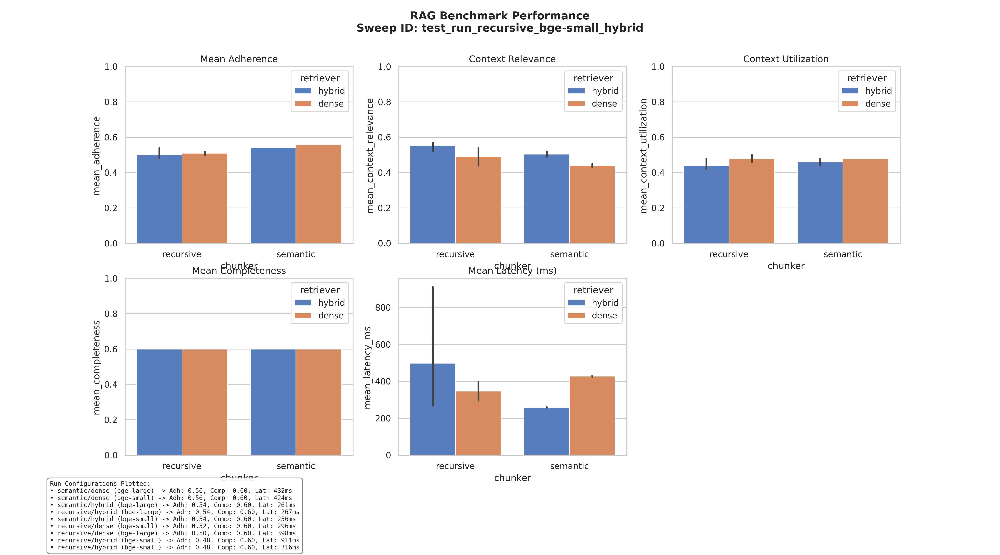

# 🏆 RAGStack Evaluation Leaderboard - test_run_recursive_bge-small_hybrid

This is an automatically generated summary of the RAG benchmarking runs for sweep session `test_run_recursive_bge-small_hybrid`.

## 📊 Run Group: covidqa - test_run_recursive_bge-small_hybrid
**Sweep ID:** `test_run_recursive_bge-small_hybrid`

| run_id | chunker | embedder | retriever | mean_adherence | mean_context_relevance | mean_context_utilization | mean_latency_ms | timestamp |
| --- | --- | --- | --- | --- | --- | --- | --- | --- |
| test_run_recursive_bge-small_hybrid | recursive | bge-small | hybrid | 0.480 | 0.570 | 0.420 | 316.4 | 2026-07-05T06:38:04.535577 |

### Performance Visualization

*Last updated: 2026-07-05 12:20:59*