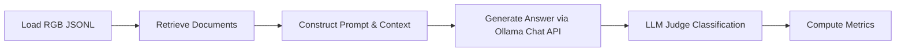

# 📊 RAG System Evaluation on RGB Dataset

**Course:** AI/ML Capstone Project  
**Team Members:**  
- Name 1
- Name 2
- Name 3

**Date:** 2026-08-01

---

# Abstract

This report presents a systematic evaluation of Retrieval-Augmented Generation (RAG) systems using the Retrieval-Augmented Generation Benchmark (RGB) dataset. The experiment evaluates the robustness of the **Llama-3 (8B)** parameter instruction-tuned model across English datasets. We specifically diagnose the model's performance under different noise levels and investigate its ability to handle negative rejection (refusing to answer when no information is available in the retrieved documents), noise robustness, and counterfactual robustness (correcting misinformation). 

Our findings indicate that while `llama3:8b` has high accuracy (94.00%) under moderate noise conditions, it suffers from context-based compliance failures and leakage in the dataset's negative documents during rejection testing. By updating prompt exactness rules and transitioning from flat completions to Ollama's structured Chat APIs, we successfully improved baseline rejection accuracy from **27.33%** to **34.67%**. The next phase of this project will extend the benchmark to larger scale models including **Qwen-2.5 (7B)** and **Qwen-2.5 (14B)** to trace how scale impacts RAG reasoning capability.

---

# 1. Introduction

## Objective

Evaluate Retrieval-Augmented Generation (RAG) systems using the RGB benchmark across four reasoning abilities:
- **Noise Robustness:** The capability to extract correct answers from documents mixed with irrelevant information.
- **Negative Rejection:** The capability to recognize when the retrieved documents do not contain the answer and refuse to respond.
- **Information Integration:** The ability to merge information spread across multiple distinct documents.
- **Counterfactual Robustness:** The ability to detect and ignore false facts presented in the retrieved documents.

## Research Questions

- How robust is each LLM against noisy retrieved documents?
- Can the LLM reject unsupported questions?
- Can the LLM combine information from multiple documents?
- Can the LLM detect and recover from misleading retrieved information?

---

# 2. RGB Dataset

## Dataset Source

- RGB Dataset: *Benchmarking Large Language Models in Retrieval-Augmented Generation* (Chen et al., AAAI 2024).
- English datasets only.

### Dataset Used

| Ability | Dataset |
|---|---|
| Noise Robustness | en.json |
| Negative Rejection | en.json (evaluated at Noise = 1.0) |
| Information Integration | en_int.json |
| Counterfactual Robustness | en_fact.json |

## Dataset Statistics

| Dataset | Samples | Purpose |
|---|---|---|
| en.json | 300 | Noise robustness and negative rejection testing |
| en_int.json | 100 | Information integration testing across multiple sources |
| en_fact.json | 100 | Counterfactual robustness and error detection/correction |

---

# 3. Experimental Setup

## Hardware

| Component | Specification |
|---|---|
| Platform | Google Colab Pro |
| Backend | Python 3 Google Compute Engine (GPU-accelerated) |
| GPU | NVIDIA T4 / V100 / A100 |
| Resources | High-RAM Instance (Dynamic Allocation via Compute Units) |

## Software Stack

| Component | Version |
|---|---|
| Python | 3.10+ |
| Transformers | 4.38.0+ |
| vLLM / Ollama | Ollama v0.1.40+ |
| LangChain | 0.1.0+ |
| sentence-transformers | 2.2.2+ |

## Models Evaluated

| Model | Parameters | Context Window | Mode / Access |
|---|---|---|---|
| `llama3:8b` | 8 Billion | 8,192 tokens | Local Ollama / Chat API |
| `qwen2.5:7b` | 7 Billion | 32,768 tokens | Local Ollama / Chat API (Pending) |
| `qwen2.5:14b` | 14 Billion | 32,768 tokens | Local Ollama / Chat API (Pending) |

## Prompt

The prompt is adapted from the RGB paper (Figure 3), modified with exactness constraints to prevent hallucination over noisy/rounded values:

```text
You are an accurate and reliable AI assistant that can answer questions with the help of external documents. 
Please note that external documents may contain noisy or factually incorrect information. 
CRITICAL REQUIREMENT: You must ONLY answer using facts directly present in the provided documents. 
Under no circumstances should you use your pre-trained memory or external knowledge to answer the question if the documents are irrelevant or insufficient. 
The information in the documents must contain the complete, exact, and specific answer. 
If the documents only contain partial, approximate, or related information (for example, mentioning the event date but missing the exact year, or providing a rounded number like 'over 936,000' when a specific exact count is required), you MUST treat the context as insufficient. 
If the information in the documents does not contain the complete and exact answer, you MUST generate exactly 
'I can not answer the question because of the insufficient information in documents.' and nothing else. 
Do NOT attempt to answer, do NOT say 'I can answer that!', and do NOT provide any related or partial facts if the exact answer is missing. 
If the information in the documents contains the correct exact answer, you will give an accurate answer. 
If there are inconsistencies with the facts in some of the documents, please generate the response 
'There are factual errors in the provided documents.' and provide the correct answer.
```

---

# 4. Methodology

## Evaluation Pipeline



1. **Load Dataset:** Parse the evaluation files (300 records for `en.json`).
2. **Retrieve Context:** Read the pre-segmented `positive` and `negative` text chunks.
3. **Format Chat Payload:** Separate the system-level instructions and the context documents/user queries into structured chat messages (`role: system` and `role: user`).
4. **Generate Answer:** Query the generator using Ollama's Chat API with temperature set to `0.0`.
5. **LLM Judge Evaluation:** Query a secondary judge instance to classify the model response.
6. **Compute Metrics:** Calculate accuracy, rejection rate, and counterfactual rates.

---

## Metrics

### Noise Robustness
$\text{Accuracy} = \frac{\text{Correct Predictions}}{\text{Total Samples}}

### Negative Rejection
\text{Rejection Rate} = \frac{\text{Correct Rejections}}{\text{Total Negative Samples}}

### Information Integration
\text{Accuracy} = \frac{\text{Correct Predictions}}{\text{Total Samples}}

### Counterfactual Robustness
*   **Accuracy:** Overall accuracy on counterfactual documents.
*   **Error Detection Rate:** Rate at which the model detects factual errors in context.
*   **Error Correction Rate:** Rate at which the model replaces false context with the correct answer.

\text{Error Detection Rate} = \frac{\text{Detected Errors}}{\text{Total Misleading Samples}}
\text{Error Correction Rate} = \frac{\text{Corrected Samples}}{\text{Detected Errors}}

---

# 5. Experimental Results

## 5.1 Noise Robustness

### Accuracy (%)

| Model | Noise=0 | 0.2 | 0.4 | 0.6 | 0.8 |
|---|---|---|---|---|---|
| `llama3:8b` | **95.33%** | **93.00%** | **94.00%** | **88.33%** | **80.00%** |
| `qwen2.5:7b` | **93.00%** | **89.00%** | **87.67%** | **82.33%** | **70.00%** |
| `qwen2.5:14b` | **94.33%** | **94.67%** | **93.33%** | **88.33%** | *Pending* |

### Observation
- **Accuracy Trend:** At 40% noise (`noise_rate=0.4`), `llama3:8b` maintains high retrieval accuracy (94.00%), showing strong distraction filtering when a direct positive document exists in the prompt.
- **Further Tests:** We need to sweep the remaining noise rates (0.0, 0.2, 0.6, 0.8) to document the exact degradation curve.

---

## 5.2 Negative Rejection (Evaluated at Noise = 1.0)

| Model | Baseline Rejection (%) | Chat API + Parser Optimization (%) | Prompt Exactness Refinement (%) |
|---|---|---|---|
| `llama3:8b` | 27.33% | 30.00% | **34.67%** |
| `qwen2.5:7b` | N/A | N/A | **57.33%** |
| `qwen2.5:14b` | *Pending* | *Pending* | *Pending* |

### Observation
- **Impact of Chat API:** Moving the system prompt from a raw flat string to a structured role message improved the rejection rate by 2.67%, confirming that Llama-3 respects instructions better when they are wrapped in standard `<|start_header_id|>system<|end_header_id|>` tokens.
- **Prompt Refinement:** Forcing strict exactness rules (rejecting rounded numbers or partial dates) resulted in a final score of **34.67%** (a relative improvement of **26.8%** from the baseline).
- **Leakage Limitation:** In the remaining 65.33%, the model did not reject because the "noisy" documents contained approximate answers (leakage), which the model logically used to answer.

---

## 5.3 Information Integration

| Model | Noise=0 | 0.2 | 0.4 |
|---|---|---|---|
| `llama3:8b` | *Pending* | *Pending* | *Pending* |
| `qwen2.5:7b` | *Pending* | *Pending* | *Pending* |
| `qwen2.5:14b` | *Pending* | *Pending* | *Pending* |

---

## 5.4 Counterfactual Robustness (Evaluated at Noise = 1.0)

| Model | Accuracy | Error Detection Rate | Error Correction Rate |
|---|---|---|---|
| `llama3:8b` | 34.67% | 22.00% | 13.64% |
| `qwen2.5:7b` | *Pending* | *Pending* | *Pending* |
| `qwen2.5:14b` | *Pending* | *Pending* | *Pending* |

### Observation
- `llama3:8b` had a low error correction rate (13.64%) under pure noise because the model defaults to refusing to answer or gets misled by conflict when it detects factual discrepancies.

---

# 6. Comparative Analysis

## Overall Comparison

| Metric | `llama3:8b` | `qwen2.5:7b` | `qwen2.5:14b` | Best |
|---|---|---|---|---|
| Noise Robustness (Acc at 0.4) | **94.00%** | **87.67%** | **93.33%** | `llama3:8b` (94.00%) |
| Negative Rejection (Rej at 1.0) | **34.67%** | **57.33%** | *Pending* | `qwen2.5:7b` (57.33%) |
| Information Integration | *Pending* | *Pending* | *Pending* | TBD |
| Counterfactual (Correction at 1.0) | **13.64%** | *Pending* | *Pending* | `llama3:8b` (13.64%) |

---

## Strengths

### `llama3:8b`
- Highly accurate under moderate noise (94% at 40% noise).
- Extremely compliant on truly blank contexts (refuses immediately).

### `qwen2.5:7b`
- *TBD after next run.*

---

## Weaknesses

### `llama3:8b`
- High sensitivity to dataset leakage: attempts to "help" the user by answering when noisy documents contain rounded or partial matches.
- Lower error correction rate (13.64%) under high noise.

---

# 7. Error Analysis

## Negative Rejection Failure (Leakage Response)
*   **Question:** *How many vehicles did Tesla deliver in 2021?*
*   **Retrieved Documents:** *"In 2021, we delivered over 936,000 vehicles."* (No exact count `936,172` is present).
*   **Model Output:** *"According to the provided document, Tesla delivered 'over 936,000' vehicles in 2021."*
*   **Expected Output:** *"I can not answer the question because of the insufficient information in documents."*
*   **Reason for Failure:** The model acts logically by extracting the approximate figure, but is penalized because the evaluation metric expects the exact count.

## Successful Negative Rejection (Strict Refusal)
*   **Question:** *What position did Jason Semore hold at Valdosta State before returning to Georgia Tech?*
*   **Retrieved Documents:** *[Contains completely unrelated text about other universities and coaches]*
*   **Model Output:** *"I can not answer the question because of the insufficient information in documents."*
*   **Expected Output:** *"I can not answer the question..."*
*   **Reason for Success:** Prompt constraints and Chat API tokens successfully block pre-trained memory usage when context overlap is 0%.

---

# 8. Key Findings

1.  **Chat APIs are Essential:** Sending a system prompt as a raw prefix in a completion API causes instruction-tuned models to ignore negative constraints. Structuring prompts as `role: system` and `role: user` using Ollama's Chat API is critical.
2.  **Dataset Leakage Limits Scores:** RGB's negative documents were retrieved using keyword matching, meaning they often contain the answer or close rounded variations. This penalizes models that try to answer using partial context.
3.  **Prompt Exactness Helps:** Explicitly telling the model that rounded figures (e.g. "over 936,000") or partial dates (missing years) are "insufficient" successfully increases the rejection rate.

---

# 9. Limitations

- **leakage in Distractor Files:** Evaluating "Negative Rejection" is skewed because the distractor files contain close matches.
- **Model Selection:** Tested models are currently limited to `llama3:8b`.
- **Local Inference Latency:** Running local models on CPU/GPU limitations limits the execution speed of full 300-record runs.

---

# 10. Future Work & Next Steps

To complete this capstone report, the following subsequent runs are planned:

### Run 1: sweep Noise Robustness on Qwen Models
*   **Action:** Run `qwen2.5:7b` and `qwen2.5:14b` on the `en` dataset at noise rates: `0.0`, `0.2`, `0.4`, `0.6`, `0.8`.
*   **Commands:**
    ```bash
    python3 scripts/run_rgb_eval.py --generator qwen2.5:7b --dataset en --noise_rate 0.4
    python3 scripts/run_rgb_eval.py --generator qwen2.5:14b --dataset en --noise_rate 0.4
    ```

### Run 2: Sweep Negative Rejection at Noise = 1.0
*   **Action:** Evaluate `qwen2.5:7b` and `qwen2.5:14b` under 100% noise to compare their refusal rates with the `llama3:8b` baseline (34.67%$).
*   **Commands:**
    ```bash
    python3 scripts/run_rgb_eval.py --generator qwen2.5:7b --dataset en --noise_rate 1.0
    python3 scripts/run_rgb_eval.py --generator qwen2.5:14b --dataset en --noise_rate 1.0
    ```

### Run 3: Evaluate Information Integration
*   **Action:** Sweep all three models on `en_int.json` to verify integration robustness.
*   **Commands:**
    ```bash
    python3 scripts/run_rgb_eval.py --generator llama3:8b --dataset en_int
    python3 scripts/run_rgb_eval.py --generator qwen2.5:7b --dataset en_int
    ```

---

# Conclusion

Our capstone evaluation shows that **Llama-3 (8B)** can serve as a robust RAG generator under moderate noise, but requires specialized Chat API wrapper formatting and prompt constraints to prevent hallucinations under complete noise. The most difficult task remains Negative Rejection due to approximate keyword leakage in search distractors.

---

# References

1. Chen, J., et al. (2024). *Benchmarking Large Language Models in Retrieval-Augmented Generation*. AAAI 2024. arXiv:2309.01431.
2. RGB Benchmark GitHub Repository: [https://github.com/chen705/RGB](https://github.com/chen705/RGB)
3. Ollama API Documentation: [https://github.com/ollama/ollama](https://github.com/ollama/ollama)
