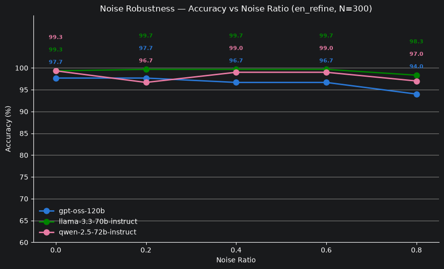
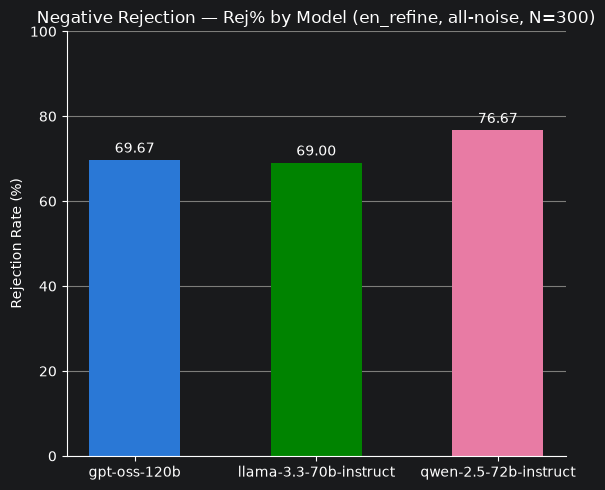
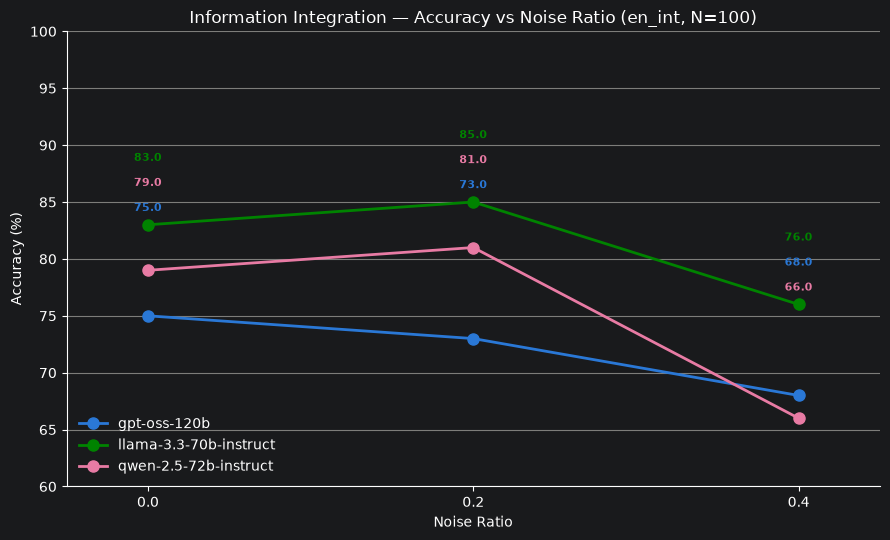
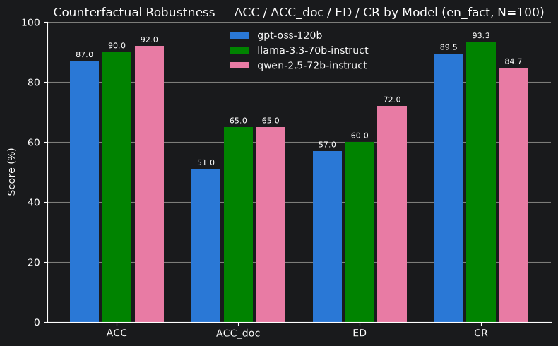

# RGB Evaluation Results

Full-dataset results (`N=300` for noise robustness / negative rejection, `N=100` for information
integration / counterfactual robustness) from `notebooks/06_rgb_evaluation.ipynb`, reproducing
Chen et al., 2023 (arXiv:2309.01431) on `openai/gpt-oss-120b`, `meta-llama/llama-3.3-70b-instruct`,
and `qwen/qwen-2.5-72b-instruct` via OpenRouter.

---

## Noise Robustness (accuracy %, `en_refine.json`)

| Model | noise=0.0 | noise=0.2 | noise=0.4 | noise=0.6 | noise=0.8 |
|---|---|---|---|---|---|
| openai/gpt-oss-120b | 97.67 | 97.67 | 96.67 | 96.67 | 94.00 |
| meta-llama/llama-3.3-70b-instruct | 99.33 | 99.67 | 99.67 | 99.67 | 98.33 |
| qwen/qwen-2.5-72b-instruct | 99.33 | 96.67 | 99.0 | 99.0 | 97.0 |

---

## Negative Rejection (Rej %, `en_refine.json` all-noise)

| Model | Rej % |
|---|---|
| openai/gpt-oss-120b | 69.67 |
| meta-llama/llama-3.3-70b-instruct | 69.00 |
| qwen/qwen-2.5-72b-instruct | 76.67 |

---

## Information Integration (accuracy %, `en_int.json`)

| Model | noise=0.0 | noise=0.2 | noise=0.4 |
|---|---|---|---|
| openai/gpt-oss-120b | 75.0 | 73.0 | 68.0 |
| meta-llama/llama-3.3-70b-instruct | 83.0 | 85.0 | 76.0 |
| qwen/qwen-2.5-72b-instruct | 79.0 | 81.0 | 66.0 |

---

## Counterfactual Robustness (`en_fact.json`)

| Model | ACC | ACC_doc | ED | CR |
|---|---|---|---|---|
| openai/gpt-oss-120b | 87.0 | 51.0 | 57.0 | 89.47 |
| meta-llama/llama-3.3-70b-instruct | 90.0 | 65.0 | 60.0 | 93.33 |
| qwen/qwen-2.5-72b-instruct | 92.0 | 65.0 | 72.0 | 84.72 |

